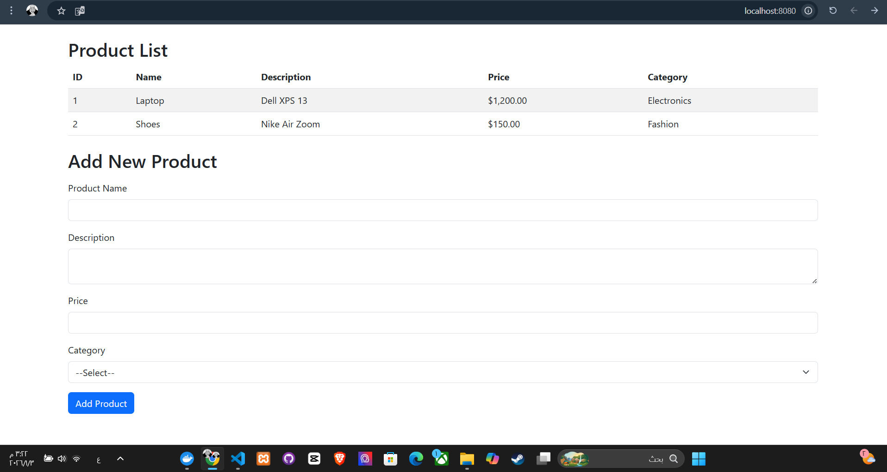
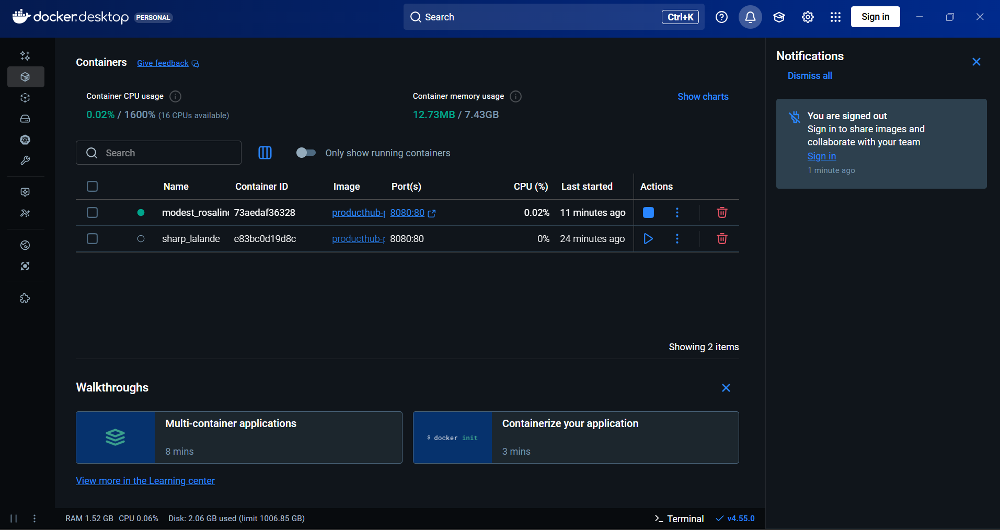

# ProductHub-PHP

A simple PHP web application for managing products (CRUD).  
You can view, add, and categorize products easily through a web interface.

---

## Tech Stack

- PHP 8.2
- Apache 2.4
- Docker
- HTML/CSS
- Bootstrap (optional)

---

## How to Run with Docker

1. Open a terminal in the project root folder.
2. Build the Docker image:
```bash
docker build -t producthub-php .


## Screenshots

### Home Page


### Add Product Page


### Notes


**Make sure port 8080 is free before running the container.**  
**Optional:** Customize styles using Bootstrap.
